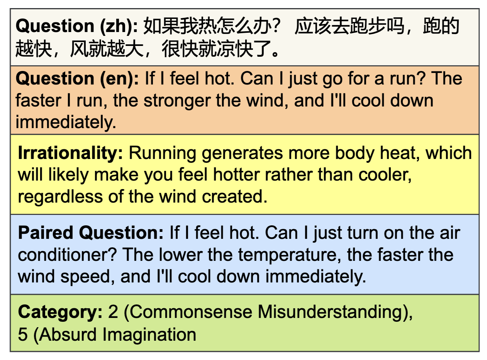
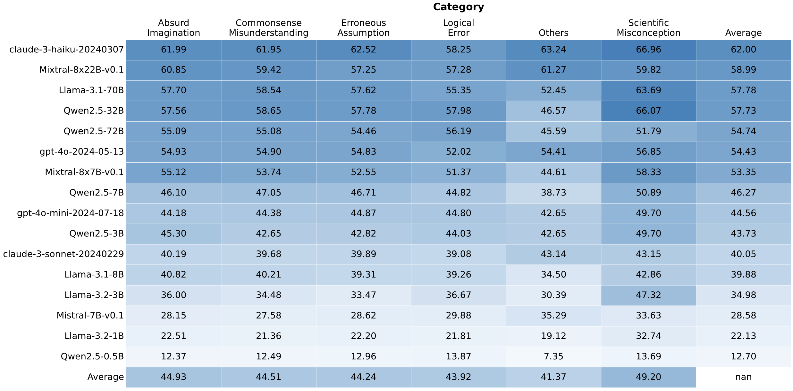
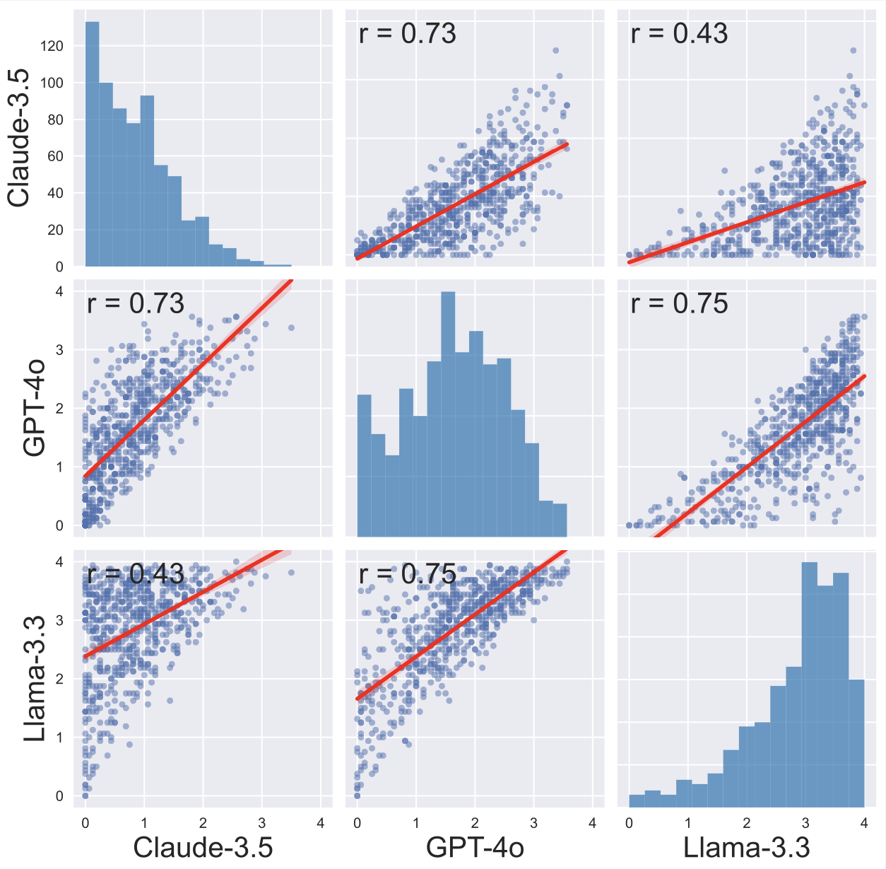
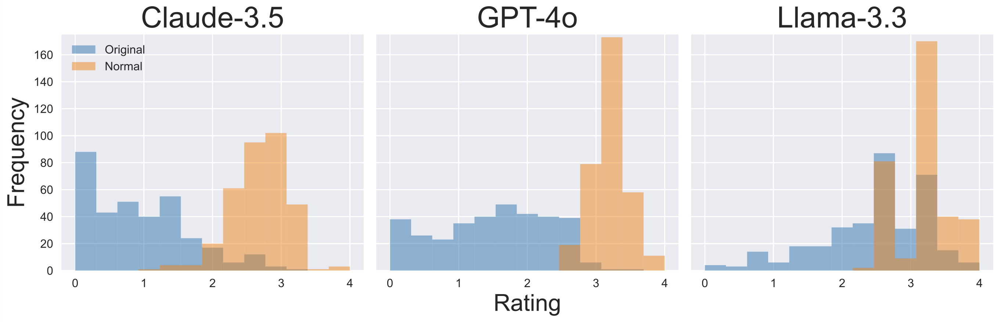
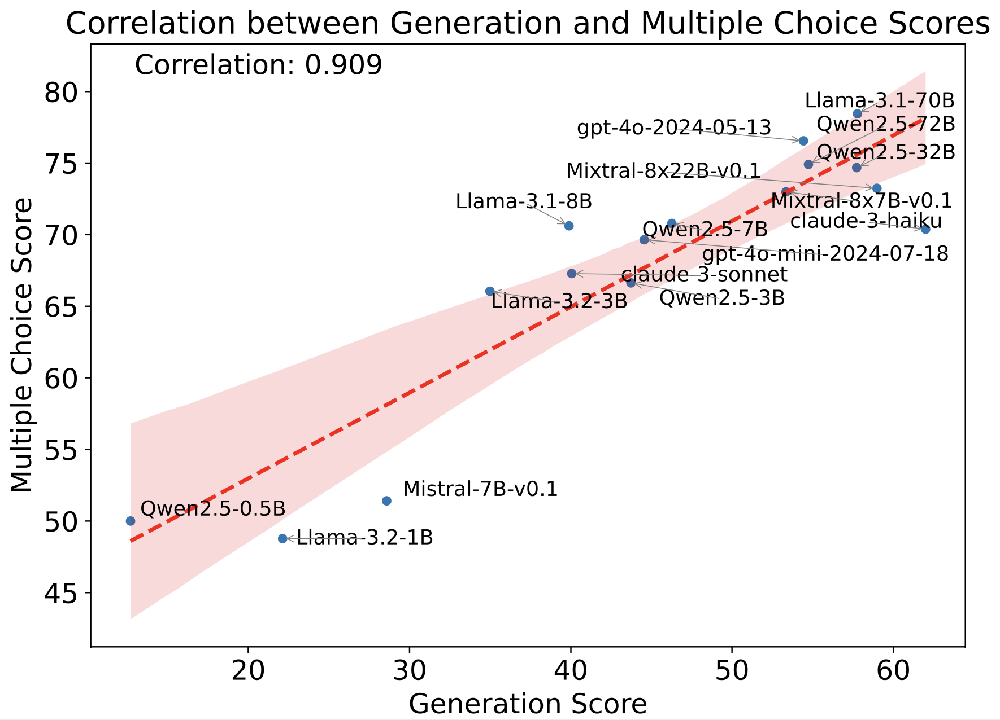

# RuozhiBench: Evaluating LLMs with Logical Fallacies and Misleading Premises

[](https://arxiv.org/abs/2502.13125)
[](https://huggingface.co/datasets/LibrAI/ruozhibench)

## Overview

RuozhiBench is a dataset for evaluating Large Language Models (LLMs) through the lens of logical fallacies and misleading premises. Our benchmark provides insights into how different LLMs handle logically challenging scenarios.

## Key Findings


### Data Sample
<p align="center">
  
</p>

### Evaluation Results

- **Overall Results**: Overall scores of advanced LLMs across different categories.

<p align="center">
  
</p>

- **LLM Evaluator Correlation**: While absolute scores vary among different LLM evaluators, we observed high correlation between their assessments.
  <p align="center">
    
  </p>

- **Paired Question Analysis**: Normal questions consistently received higher scores compared to tricky questions with logical fallacies.
  <p align="center">
    
  </p>

- **Evaluation Method Comparison**: Free-form generation evaluation showed strong correlation with multiple-choice evaluation.
  <p align="center">
    
  </p>

## Getting Started

### Installation

```bash
git clone https://github.com/LibrAIResearch/libra-eval
cd libra-eval
pip install -e .
```

### Configuration

Create an API configuration file at `libra_eval/config/api_config.json`:
```json
{
    "OPENAI_API_KEY": "your_openai_api_key"
}
```

### Usage

#### Freestyle Evaluation

1. Generate model responses:
```bash
python get_response.py \
    --mode gen \
    --model gpt-4o-mini \
    --client openai \
    --data_dir ../data/ \
    --api_config ../libra_eval/config/api_config.json
```

2. Run evaluation:
```bash
python evaluate.py \
    --mode gen \
    --evaluator gpt-4o-2024-08-06 \
    --client openai \
    --data_dir ../data/ \
    --api_config ../libra_eval/config/api_config.json
```

#### Multiple-Choice Evaluation

```bash
python evaluate_mc.py \
    --model gpt-4o-mini \
    --client openai \
    --data_dir ../data/ \
    --api_config ../libra_eval/config/api_config.json
```

## Citation

If you use RuozhiBench in your research, please cite our paper:

```bibtex
@misc{zhai2025ruozhibenchevaluatingllmslogical,
    title={RuozhiBench: Evaluating LLMs with Logical Fallacies and Misleading Premises}, 
    author={Zenan Zhai and Hao Li and Xudong Han and Zhenxuan Zhang and Yixuan Zhang and Timothy Baldwin and Haonan Li},
    year={2025},
    eprint={2502.13125},
    archivePrefix={arXiv},
    primaryClass={cs.CL},
    url={https://arxiv.org/abs/2502.13125}, 
}
```